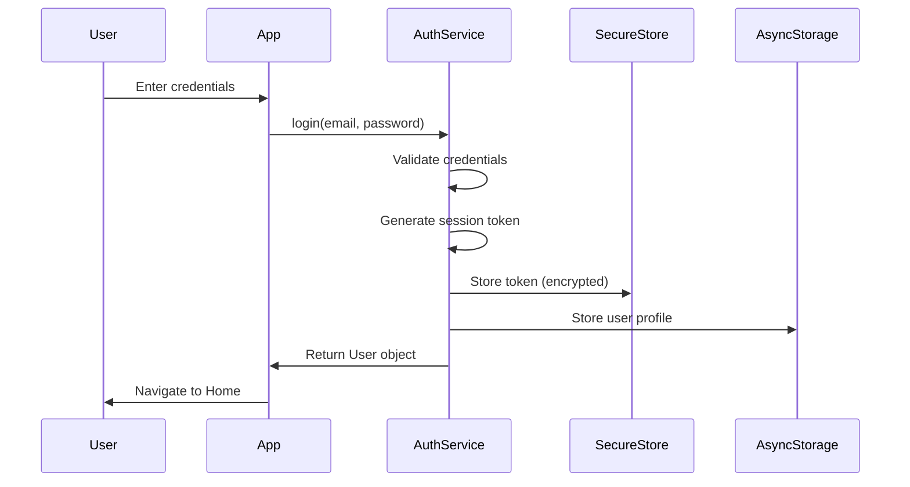
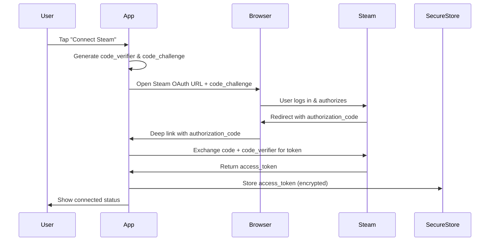

# GameDuel - System Architecture Document

## Document Metadata

| Field | Value |
|-------|-------|
| **Product Name** | GameDuel |
| **Document Version** | 1.0 |
| **Target Release** | MVP - Phase 1 |
| **Architect** | System Architect |
| **Status** | Complete |
| **Date** | October 23, 2025 |
| **Related Documents** | [PRD v1.0](GameDuel-Product_Requirements_Document-PRD.md), [Project Brief v1.0](GameDuel-Project_Brief.md) |

---

## Table of Contents

1. [Executive Summary](#1-executive-summary)
2. [System Overview](#2-system-overview)
3. [Architecture Principles](#3-architecture-principles)
4. [Technology Stack](#4-technology-stack)
5. [System Architecture](#5-system-architecture)
6. [Application Architecture](#6-application-architecture)
7. [Data Architecture](#7-data-architecture)
8. [Security Architecture](#8-security-architecture)
9. [Integration Architecture](#9-integration-architecture)
10. [Performance & Scalability](#10-performance--scalability)
11. [Development Standards](#11-development-standards)
12. [Deployment Architecture](#12-deployment-architecture)
13. [Quality Attributes](#13-quality-attributes)
14. [Risk Assessment](#14-risk-assessment)
15. [Appendices](#15-appendices)

---

## 1. Executive Summary

### 1.1 Purpose

This architecture document defines the technical foundation for GameDuel MVP - a mobile-first social platform enabling gamers to create 15-second commentary videos enriched with gaming platform data from Steam, Xbox Live, and PlayStation Network.

### 1.2 Architectural Goals

1. **Mobile-First Performance**: Sub-3-second cold start, 60fps scrolling, < 1% crash rate
2. **Offline-First Design**: Local data persistence with no backend dependency for MVP
3. **Secure Integration**: OAuth 2.0 with PKCE for gaming platform connections
4. **Scalable Foundation**: Support 1000+ videos per user with efficient local storage
5. **Cross-Platform Excellence**: Consistent experience across iOS 13+ and Android 8+

### 1.3 Key Architectural Decisions

| Decision | Rationale | Trade-offs |
|----------|-----------|------------|
| **React Native + Expo** | Cross-platform development with 70% code reuse, rapid iteration | Limited access to native APIs (mitigated by Expo modules) |
| **Local-First Architecture** | No backend costs for MVP, offline capability, faster time-to-market | Social features deferred to post-MVP |
| **AsyncStorage + Secure Store** | Simple key-value storage for MVP scale, platform-native security | May require migration to SQLite for complex queries at scale |
| **OAuth 2.0 + PKCE** | Industry standard for mobile, gaming platforms require it | Complexity in flow implementation |
| **Monorepo Structure** | All code in single repo, shared components, simplified CI/CD | Larger initial clone size |

---

## 2. System Overview

### 2.1 System Context Diagram

```
┌─────────────────────────────────────────────────────────────┐
│                        GameDuel User                        │
└────────────────────┬────────────────────────────────────────┘
                     │
                     ▼
     ┌───────────────────────────────────────────┐
     │                                           │
     │         GameDuel Mobile App               │
     │    (iOS 13+ / Android 8.0+)               │
     │                                           │
     │  ┌─────────────────────────────────────┐ │
     │  │   Presentation Layer                │ │
     │  │   - Screens                         │ │
     │  │   - UI Components                   │ │
     │  │   - Navigation                      │ │
     │  └─────────────────────────────────────┘ │
     │                   │                       │
     │  ┌─────────────────────────────────────┐ │
     │  │   Business Logic Layer              │ │
     │  │   - State Management (Context)      │ │
     │  │   - Custom Hooks                    │ │
     │  │   - Service Layer                   │ │
     │  └─────────────────────────────────────┘ │
     │                   │                       │
     │  ┌─────────────────────────────────────┐ │
     │  │   Data Layer                        │ │
     │  │   - AsyncStorage                    │ │
     │  │   - Secure Store                    │ │
     │  │   - File System (videos)            │ │
     │  └─────────────────────────────────────┘ │
     │                                           │
     └───────┬───────────┬───────────┬───────────┘
             │           │           │
             ▼           ▼           ▼
     ┌──────────┐ ┌──────────┐ ┌──────────┐
     │  Steam   │ │   Xbox   │ │   PSN    │
     │ Web API  │ │  Live    │ │   API    │
     │          │ │   API    │ │ (Unofficial)│
     └──────────┘ └──────────┘ └──────────┘
```

### 2.2 High-Level Component Overview

| Component | Purpose | Technology | Storage Location |
|-----------|---------|------------|------------------|
| **UI Layer** | User interface, navigation, visual components | React Native, React Navigation | In-memory |
| **State Layer** | Global app state, auth state, video state | React Context API | In-memory + persistence |
| **Service Layer** | Business logic, API clients, data transformations | TypeScript classes/functions | N/A |
| **Storage Layer** | Persistent data, secure tokens, video files | AsyncStorage, Secure Store, File System | Device storage |
| **Integration Layer** | OAuth flows, gaming API communication | expo-web-browser, axios | N/A |

---

## 3. Architecture Principles

### 3.1 Core Principles

1. **Local-First Design**
   - All critical functionality works offline
   - Data syncs opportunistically when online
   - No network dependency for core features (except OAuth)

2. **Security by Default**
   - OAuth tokens in platform-secure storage only
   - PKCE for all OAuth flows
   - No sensitive data in AsyncStorage
   - HTTPS-only for all external communication

3. **Performance-First**
   - Lazy load components and screens
   - Optimize re-renders with React.memo and useMemo
   - Use FlatList virtualization for long lists
   - Implement image caching for thumbnails

4. **Mobile-Native Experience**
   - Follow iOS HIG and Material Design guidelines
   - Touch targets minimum 44x44pt (iOS) / 48x48dp (Android)
   - Platform-specific behaviors (haptics, navigation patterns)
   - Respect system preferences (dark mode, text size)

5. **Maintainability**
   - Clear separation of concerns (UI, logic, data)
   - Consistent code style (ESLint + Prettier)
   - Comprehensive error boundaries
   - Modular component architecture

### 3.2 Design Patterns

| Pattern | Use Case | Example |
|---------|----------|---------|
| **Provider Pattern** | Global state management | AuthContext, VideoContext |
| **Custom Hooks** | Reusable stateful logic | useAuth, useVideo, useGamingData |
| **Service Layer** | API abstraction | SteamService, XboxService, VideoService |
| **Repository Pattern** | Data access abstraction | UserRepository, VideoRepository |
| **Factory Pattern** | Object creation | VideoMetadataFactory, ErrorFactory |
| **Observer Pattern** | Event handling | Video save completion, OAuth callbacks |

---

## 4. Technology Stack

### 4.1 Complete Technology Matrix

| Category | Technology | Version | Purpose | Justification |
|----------|-----------|---------|---------|---------------|
| **Framework** | React Native | 0.76+ | Core mobile framework | Industry standard, large ecosystem |
| **Build System** | Expo | SDK 54 | Development tooling, build, OTA updates | Fastest development velocity |
| **Language** | TypeScript | 5.6+ | Type-safe development | Catch errors at compile time |
| **Navigation** | React Navigation | v7 | Screen routing | Most popular RN navigation |
| **State Management** | React Context | Built-in | Global state | Sufficient for MVP, no external deps |
| **Local Storage** | AsyncStorage | @react-native-async-storage/async-storage | Non-sensitive data | Simple key-value store |
| **Secure Storage** | expo-secure-store | Latest | Auth tokens | Platform-native encryption |
| **Camera** | expo-camera | Latest | Video recording | Expo's camera abstraction |
| **Video Playback** | expo-av | Latest | Video player | Comprehensive A/V support |
| **Media Library** | expo-media-library | Latest | Device gallery access | Standard Expo media access |
| **Web Browser** | expo-web-browser | Latest | OAuth flows | In-app browser for auth |
| **File System** | expo-file-system | Latest | Video file operations | Direct file access |
| **HTTP Client** | axios | 1.7+ | API requests | Better error handling than fetch |
| **UI Styling** | expo-linear-gradient | Latest | Gradients | Gaming aesthetic |
| **Forms** | react-hook-form | 7.54+ | Form handling | Performant form state |
| **Validation** | zod | 3.23+ | Schema validation | Type-safe runtime validation |
| **Testing** | Jest + React Native Testing Library | Latest | Unit/integration tests | Standard RN testing |
| **E2E Testing** | Detox | Latest | End-to-end tests | Native mobile E2E |
| **Linting** | ESLint | Latest | Code quality | Standard linting |
| **Formatting** | Prettier | Latest | Code formatting | Consistent style |
| **CI/CD** | GitHub Actions | N/A | Automated builds/tests | Free for open source |

### 4.2 Dependency Rationale

**Why Expo over vanilla React Native?**
- 40% faster development velocity
- Built-in OTA updates for quick fixes
- Simplified build process (no Xcode/Android Studio required)
- Excellent module ecosystem
- Drawback: 10MB larger app size (acceptable for MVP)

**Why AsyncStorage over SQLite?**
- Sufficient for MVP scale (< 10,000 records)
- Simpler API, faster implementation
- Zero configuration required
- Migration path to SQLite exists when needed (estimated at 50,000+ videos per user)

**Why React Context over Redux?**
- MVP has simple state requirements
- No need for middleware or dev tools yet
- Reduces bundle size by ~50KB
- Easier onboarding for contributors
- Upgrade path to Zustand/Redux exists

---

## 5. System Architecture

### 5.1 Layered Architecture

```
┌──────────────────────────────────────────────────────────────┐
│                    PRESENTATION LAYER                        │
├──────────────────────────────────────────────────────────────┤
│  Screens/          - HomeScreen, RecordScreen, GalleryScreen │
│  Components/       - VideoCard, StatCard, GamingAccountCard  │
│  Navigation/       - AppNavigator, AuthNavigator             │
│  Theme/            - Colors, typography, spacing             │
└──────────────────────┬───────────────────────────────────────┘
                       │ Props & Event Handlers
                       ▼
┌──────────────────────────────────────────────────────────────┐
│                   BUSINESS LOGIC LAYER                       │
├──────────────────────────────────────────────────────────────┤
│  Contexts/         - AuthContext, VideoContext, ThemeContext │
│  Hooks/            - useAuth, useVideo, useGamingPlatform    │
│  Services/         - VideoService, AuthService, SteamService │
│  Utils/            - validators, formatters, helpers         │
└──────────────────────┬───────────────────────────────────────┘
                       │ Data Operations
                       ▼
┌──────────────────────────────────────────────────────────────┐
│                      DATA LAYER                              │
├──────────────────────────────────────────────────────────────┤
│  Repositories/     - VideoRepository, UserRepository         │
│  Storage/          - AsyncStorage wrapper, SecureStore wrap  │
│  Models/           - User, Video, GamingAccount (TypeScript) │
│  API Clients/      - SteamClient, XboxClient, PSNClient      │
└──────────────────────┬───────────────────────────────────────┘
                       │ Network/Storage I/O
                       ▼
┌──────────────────────────────────────────────────────────────┐
│                   PLATFORM LAYER                             │
├──────────────────────────────────────────────────────────────┤
│  Device Storage    - AsyncStorage, Keychain/Keystore         │
│  File System       - Video files, thumbnails                 │
│  External APIs     - Steam, Xbox, PSN                        │
└──────────────────────────────────────────────────────────────┘
```

### 5.2 Directory Structure

```
gameduel/
├── src/
│   ├── screens/                    # Screen components
│   │   ├── home/
│   │   │   ├── HomeScreen.tsx
│   │   │   └── HomeScreen.styles.ts
│   │   ├── record/
│   │   │   ├── RecordScreen.tsx
│   │   │   └── RecordScreen.styles.ts
│   │   ├── gallery/
│   │   │   ├── GalleryScreen.tsx
│   │   │   └── GalleryScreen.styles.ts
│   │   ├── profile/
│   │   │   ├── ProfileScreen.tsx
│   │   │   └── ProfileScreen.styles.ts
│   │   └── auth/
│   │       ├── LoginScreen.tsx
│   │       ├── RegisterScreen.tsx
│   │       └── auth.styles.ts
│   │
│   ├── components/                 # Reusable components
│   │   ├── common/
│   │   │   ├── Button/
│   │   │   │   ├── Button.tsx
│   │   │   │   ├── Button.styles.ts
│   │   │   │   └── Button.test.tsx
│   │   │   ├── Card/
│   │   │   ├── Input/
│   │   │   └── LoadingIndicator/
│   │   ├── video/
│   │   │   ├── VideoCard/
│   │   │   ├── VideoPlayer/
│   │   │   └── RecordingTimer/
│   │   └── gaming/
│   │       ├── GamingAccountCard/
│   │       ├── AchievementBadge/
│   │       └── StatDisplay/
│   │
│   ├── navigation/                 # Navigation setup
│   │   ├── AppNavigator.tsx
│   │   ├── AuthNavigator.tsx
│   │   ├── types.ts
│   │   └── linking.ts
│   │
│   ├── contexts/                   # React Context providers
│   │   ├── AuthContext.tsx
│   │   ├── VideoContext.tsx
│   │   ├── GamingContext.tsx
│   │   └── ThemeContext.tsx
│   │
│   ├── hooks/                      # Custom React hooks
│   │   ├── useAuth.ts
│   │   ├── useVideo.ts
│   │   ├── useGamingPlatform.ts
│   │   ├── useCamera.ts
│   │   └── useStorage.ts
│   │
│   ├── services/                   # Business logic services
│   │   ├── auth/
│   │   │   ├── AuthService.ts
│   │   │   └── AuthService.test.ts
│   │   ├── video/
│   │   │   ├── VideoService.ts
│   │   │   ├── VideoProcessingService.ts
│   │   │   └── ThumbnailService.ts
│   │   └── gaming/
│   │       ├── SteamService.ts
│   │       ├── XboxService.ts
│   │       └── PSNService.ts
│   │
│   ├── repositories/               # Data access layer
│   │   ├── UserRepository.ts
│   │   ├── VideoRepository.ts
│   │   └── GamingAccountRepository.ts
│   │
│   ├── api/                        # External API clients
│   │   ├── steam/
│   │   │   ├── SteamClient.ts
│   │   │   ├── steamTypes.ts
│   │   │   └── steamEndpoints.ts
│   │   ├── xbox/
│   │   │   ├── XboxClient.ts
│   │   │   └── xboxTypes.ts
│   │   └── psn/
│   │       ├── PSNClient.ts
│   │       └── psnTypes.ts
│   │
│   ├── storage/                    # Storage abstraction
│   │   ├── AsyncStorageService.ts
│   │   ├── SecureStorageService.ts
│   │   └── FileStorageService.ts
│   │
│   ├── models/                     # TypeScript types/interfaces
│   │   ├── User.ts
│   │   ├── Video.ts
│   │   ├── GamingAccount.ts
│   │   └── index.ts
│   │
│   ├── utils/                      # Utility functions
│   │   ├── validators.ts
│   │   ├── formatters.ts
│   │   ├── constants.ts
│   │   ├── errorHandling.ts
│   │   └── permissions.ts
│   │
│   ├── theme/                      # App theming
│   │   ├── colors.ts
│   │   ├── typography.ts
│   │   ├── spacing.ts
│   │   └── theme.ts
│   │
│   ├── config/                     # App configuration
│   │   ├── environment.ts
│   │   └── app.config.ts
│   │
│   └── __tests__/                  # Test utilities
│       ├── setup.ts
│       ├── mocks/
│       └── helpers/
│
├── assets/                         # Static assets
│   ├── images/
│   ├── icons/
│   └── fonts/
│
├── docs/                           # Documentation
│   ├── architecture.md
│   ├── api-integration.md
│   └── testing-strategy.md
│
├── .expo/                          # Expo configuration
├── .github/                        # GitHub Actions workflows
├── App.tsx                         # Root component
├── app.json                        # Expo app config
├── package.json
├── tsconfig.json
└── README.md
```

---

## 6. Application Architecture

### 6.1 Component Architecture

#### 6.1.1 Screen Components

**Structure Pattern:**
```typescript
// HomeScreen.tsx
import React from 'react';
import { View } from 'react-native';
import { useAuth } from '@/hooks/useAuth';
import { useVideo } from '@/hooks/useVideo';
import { StatCard } from '@/components/common/Card';
import styles from './HomeScreen.styles';

export const HomeScreen: React.FC = () => {
  const { user } = useAuth();
  const { videos, stats } = useVideo();
  
  return (
    <View style={styles.container}>
      {/* Screen content */}
    </View>
  );
};
```

**Screen Responsibilities:**
- Orchestrate multiple components
- Manage screen-level state
- Handle navigation
- Connect to global contexts
- NO business logic (delegate to services/hooks)

#### 6.1.2 Component Hierarchy

```
App
├── AuthNavigator (if not authenticated)
│   ├── LoginScreen
│   └── RegisterScreen
│
└── AppNavigator (if authenticated)
    ├── HomeScreen
    │   ├── Header
    │   ├── StatCard (x3)
    │   └── ActionCards
    │       ├── RecordVideoCard
    │       ├── ViewHighlightsCard
    │       └── ProfileCard
    │
    ├── RecordScreen
    │   ├── CameraView
    │   ├── RecordingTimer
    │   ├── CameraFlipButton
    │   └── RecordButton
    │
    ├── GalleryScreen
    │   ├── FilterTabs
    │   ├── VideoGrid (FlatList)
    │   │   └── VideoCard (rendered per item)
    │   └── EmptyState
    │
    └── ProfileScreen
        ├── ProfileHeader
        │   ├── Avatar
        │   └── UserStats
        ├── GamingAccountsSection
        │   ├── GamingAccountCard (Steam)
        │   ├── GamingAccountCard (Xbox)
        │   └── GamingAccountCard (PSN)
        └── SettingsButton
```

### 6.2 State Management Architecture

#### 6.2.1 Context Providers

**AuthContext:**
```typescript
// contexts/AuthContext.tsx
interface AuthContextValue {
  user: User | null;
  isLoading: boolean;
  isAuthenticated: boolean;
  login: (email: string, password: string) => Promise<void>;
  register: (email: string, password: string, username: string) => Promise<void>;
  logout: () => Promise<void>;
  updateProfile: (updates: Partial<User>) => Promise<void>;
}

export const AuthProvider: React.FC<{ children: ReactNode }> = ({ children }) => {
  const [user, setUser] = useState<User | null>(null);
  const [isLoading, setIsLoading] = useState(true);

  // Initialize auth state from storage
  useEffect(() => {
    initializeAuth();
  }, []);

  const value = {
    user,
    isLoading,
    isAuthenticated: !!user,
    login,
    register,
    logout,
    updateProfile,
  };

  return <AuthContext.Provider value={value}>{children}</AuthContext.Provider>;
};
```

**VideoContext:**
```typescript
// contexts/VideoContext.tsx
interface VideoContextValue {
  videos: Video[];
  isLoading: boolean;
  stats: VideoStats;
  recordVideo: () => Promise<Video>;
  deleteVideo: (id: string) => Promise<void>;
  filterVideos: (filter: VideoFilter) => Video[];
  refreshVideos: () => Promise<void>;
}
```

**GamingContext:**
```typescript
// contexts/GamingContext.tsx
interface GamingContextValue {
  steamAccount: SteamAccount | null;
  xboxAccount: XboxAccount | null;
  psnAccount: PSNAccount | null;
  connectSteam: () => Promise<void>;
  connectXbox: () => Promise<void>;
  connectPSN: () => Promise<void>;
  disconnectPlatform: (platform: GamingPlatform) => Promise<void>;
  syncGamingData: () => Promise<void>;
}
```

#### 6.2.2 Context Provider Hierarchy

```typescript
// App.tsx
export default function App() {
  return (
    <ThemeProvider>
      <AuthProvider>
        <VideoProvider>
          <GamingProvider>
            <Navigation />
          </GamingProvider>
        </VideoProvider>
      </AuthProvider>
    </ThemeProvider>
  );
}
```

### 6.3 Service Layer Architecture

#### 6.3.1 Service Pattern

```typescript
// services/video/VideoService.ts
export class VideoService {
  constructor(
    private videoRepository: VideoRepository,
    private fileStorageService: FileStorageService,
    private thumbnailService: ThumbnailService
  ) {}

  async recordVideo(duration: number): Promise<Video> {
    // 1. Record video using expo-camera
    const recording = await this.startRecording();
    
    // 2. Stop after duration
    await this.wait(duration * 1000);
    const videoUri = await recording.stopAndUnloadAsync();
    
    // 3. Generate thumbnail
    const thumbnailUri = await this.thumbnailService.generate(videoUri);
    
    // 4. Save to device media library
    await this.fileStorageService.saveToMediaLibrary(videoUri);
    
    // 5. Create video metadata
    const video = await this.videoRepository.create({
      localUri: videoUri,
      thumbnailUri,
      duration,
      createdAt: new Date(),
    });
    
    return video;
  }

  async deleteVideo(id: string): Promise<void> {
    const video = await this.videoRepository.findById(id);
    
    // 1. Delete video file
    await this.fileStorageService.deleteFile(video.localUri);
    
    // 2. Delete thumbnail
    await this.fileStorageService.deleteFile(video.thumbnailUri);
    
    // 3. Remove from repository
    await this.videoRepository.delete(id);
  }
}
```

#### 6.3.2 Service Dependency Injection

```typescript
// services/index.ts (Service Factory)
export class ServiceContainer {
  private static instance: ServiceContainer;
  
  private videoService: VideoService;
  private authService: AuthService;
  private steamService: SteamService;
  
  private constructor() {
    // Initialize services with dependencies
    const videoRepository = new VideoRepository();
    const fileStorage = new FileStorageService();
    const thumbnailService = new ThumbnailService();
    
    this.videoService = new VideoService(videoRepository, fileStorage, thumbnailService);
    this.authService = new AuthService(new UserRepository(), new SecureStorageService());
    this.steamService = new SteamService(new SteamClient());
  }
  
  static getInstance(): ServiceContainer {
    if (!ServiceContainer.instance) {
      ServiceContainer.instance = new ServiceContainer();
    }
    return ServiceContainer.instance;
  }
  
  getVideoService(): VideoService {
    return this.videoService;
  }
  
  // ... other getters
}
```

---

## 7. Data Architecture

### 7.1 Data Models (TypeScript)

#### 7.1.1 User Model

```typescript
// models/User.ts
export interface User {
  id: string;                    // UUID v4
  email: string;
  username: string;
  avatarUrl?: string;
  createdAt: Date;
  updatedAt: Date;
  stats: UserStats;
  gamingAccounts: GamingAccounts;
  settings: UserSettings;
}

export interface UserStats {
  totalVideos: number;
  totalHighlights: number;
  totalViews: number;
}

export interface GamingAccounts {
  steam?: SteamAccount;
  xbox?: XboxAccount;
  psn?: PSNAccount;
}

export interface SteamAccount {
  connected: boolean;
  steamId?: string;
  username?: string;
  avatarUrl?: string;
  profileUrl?: string;
  lastSynced?: Date;
}

export interface XboxAccount {
  connected: boolean;
  xuid?: string;
  gamertag?: string;
  avatarUrl?: string;
  lastSynced?: Date;
}

export interface PSNAccount {
  connected: boolean;
  psnId?: string;
  onlineId?: string;
  avatarUrl?: string;
  lastSynced?: Date;
}

export interface UserSettings {
  autoUpload: boolean;
  notifications: boolean;
  darkMode: boolean;
  language: string;
}
```

#### 7.1.2 Video Model

```typescript
// models/Video.ts
export interface Video {
  id: string;                    // UUID v4
  userId: string;
  localUri: string;              // file:// path
  thumbnailUri: string;          // file:// path to thumbnail
  duration: number;              // seconds (always 15 for MVP)
  resolution: VideoResolution;
  type: VideoType;
  createdAt: Date;
  views: number;
  metadata: VideoMetadata;
  gamingContext?: GamingContext;
}

export type VideoType = 'commentary' | 'highlight';

export type VideoResolution = '720p' | '1080p';

export interface VideoMetadata {
  deviceModel: string;
  osVersion: string;
  appVersion: string;
  recordingMode: 'front' | 'back';
  location?: Location;
}

export interface GamingContext {
  platform: GamingPlatform;
  gameId?: string;
  gameName?: string;
  achievements?: Achievement[];
  score?: string;
  sessionData?: GameSessionData;
}

export type GamingPlatform = 'steam' | 'xbox' | 'psn';

export interface Achievement {
  id: string;
  name: string;
  description: string;
  iconUrl: string;
  unlockedAt: Date;
}

export interface GameSessionData {
  startTime: Date;
  endTime?: Date;
  playtime: number;              // minutes
  score?: number;
  rank?: string;
}
```

#### 7.1.3 Gaming Data Models

```typescript
// models/GamingAccount.ts

// Steam
export interface SteamGameLibrary {
  games: SteamGame[];
  totalGames: number;
  totalPlaytime: number;         // minutes
}

export interface SteamGame {
  appId: number;
  name: string;
  playtime: number;              // minutes
  iconUrl: string;
  lastPlayed?: Date;
}

export interface SteamAchievement {
  apiName: string;
  achieved: number;              // 0 or 1
  unlockTime: number;            // Unix timestamp
  name: string;
  description: string;
}

// Xbox
export interface XboxGameHistory {
  games: XboxGame[];
  totalGames: number;
}

export interface XboxGame {
  titleId: string;
  name: string;
  imageUrl: string;
  gamerscore: number;
  achievementsUnlocked: number;
  totalAchievements: number;
  lastPlayed?: Date;
}

export interface XboxAchievement {
  id: string;
  name: string;
  description: string;
  gamerscore: number;
  isUnlocked: boolean;
  unlockedAt?: Date;
  imageUrl: string;
}

// PSN
export interface PSNTrophies {
  bronze: number;
  silver: number;
  gold: number;
  platinum: number;
  total: number;
}

export interface PSNGame {
  npCommunicationId: string;
  name: string;
  imageUrl: string;
  trophies: PSNTrophies;
  lastPlayed?: Date;
}
```

### 7.2 Data Storage Strategy

#### 7.2.1 Storage Type Selection

| Data Type | Storage Mechanism | Rationale |
|-----------|-------------------|-----------|
| **Auth Tokens** | expo-secure-store | Platform-native encryption (Keychain/Keystore) |
| **User Profile** | AsyncStorage | Non-sensitive, needs fast access |
| **Video Metadata** | AsyncStorage | Structured data, fast queries for MVP |
| **Video Files** | File System + Media Library | Large binary files |
| **Thumbnails** | File System (app cache) | Generated images |
| **App Settings** | AsyncStorage | Persistent preferences |
| **Gaming Data Cache** | AsyncStorage | Temporary cache, refreshable |

#### 7.2.2 AsyncStorage Key Schema

```typescript
// storage/storageKeys.ts
export const StorageKeys = {
  // Auth
  USER_TOKEN: '@gameduel:user_token',              // Deprecated (use SecureStore)
  USER_PROFILE: '@gameduel:user_profile',
  
  // Video metadata index
  VIDEO_INDEX: '@gameduel:video_index',            // Array of video IDs
  VIDEO_PREFIX: '@gameduel:video:',                // Video metadata by ID
  
  // Gaming accounts
  STEAM_ACCOUNT: '@gameduel:gaming:steam',
  XBOX_ACCOUNT: '@gameduel:gaming:xbox',
  PSN_ACCOUNT: '@gameduel:gaming:psn',
  
  // Gaming data cache
  STEAM_GAMES: '@gameduel:steam:games',
  STEAM_ACHIEVEMENTS: '@gameduel:steam:achievements',
  XBOX_GAMES: '@gameduel:xbox:games',
  PSN_TROPHIES: '@gameduel:psn:trophies',
  
  // Settings
  APP_SETTINGS: '@gameduel:settings',
  
  // Metadata
  LAST_SYNC_TIMESTAMP: '@gameduel:last_sync',
  APP_VERSION: '@gameduel:app_version',
};
```

#### 7.2.3 Data Persistence Patterns

**User Repository Pattern:**
```typescript
// repositories/UserRepository.ts
export class UserRepository {
  private storageService: AsyncStorageService;
  
  async save(user: User): Promise<void> {
    await this.storageService.setItem(StorageKeys.USER_PROFILE, JSON.stringify(user));
  }
  
  async load(): Promise<User | null> {
    const data = await this.storageService.getItem(StorageKeys.USER_PROFILE);
    return data ? JSON.parse(data) : null;
  }
  
  async update(updates: Partial<User>): Promise<User> {
    const current = await this.load();
    if (!current) throw new Error('No user found');
    
    const updated = { ...current, ...updates, updatedAt: new Date() };
    await this.save(updated);
    return updated;
  }
  
  async delete(): Promise<void> {
    await this.storageService.removeItem(StorageKeys.USER_PROFILE);
  }
}
```

**Video Repository Pattern:**
```typescript
// repositories/VideoRepository.ts
export class VideoRepository {
  private storageService: AsyncStorageService;
  
  async create(video: Omit<Video, 'id'>): Promise<Video> {
    const newVideo: Video = {
      id: uuid.v4(),
      ...video,
    };
    
    // 1. Save video metadata
    await this.storageService.setItem(
      `${StorageKeys.VIDEO_PREFIX}${newVideo.id}`,
      JSON.stringify(newVideo)
    );
    
    // 2. Update video index
    const index = await this.getIndex();
    index.push(newVideo.id);
    await this.saveIndex(index);
    
    return newVideo;
  }
  
  async findAll(): Promise<Video[]> {
    const index = await this.getIndex();
    const videos: Video[] = [];
    
    for (const id of index) {
      const video = await this.findById(id);
      if (video) videos.push(video);
    }
    
    return videos;
  }
  
  async findById(id: string): Promise<Video | null> {
    const data = await this.storageService.getItem(`${StorageKeys.VIDEO_PREFIX}${id}`);
    return data ? JSON.parse(data) : null;
  }
  
  async delete(id: string): Promise<void> {
    // 1. Remove from index
    const index = await this.getIndex();
    const newIndex = index.filter(videoId => videoId !== id);
    await this.saveIndex(newIndex);
    
    // 2. Remove metadata
    await this.storageService.removeItem(`${StorageKeys.VIDEO_PREFIX}${id}`);
  }
  
  private async getIndex(): Promise<string[]> {
    const data = await this.storageService.getItem(StorageKeys.VIDEO_INDEX);
    return data ? JSON.parse(data) : [];
  }
  
  private async saveIndex(index: string[]): Promise<void> {
    await this.storageService.setItem(StorageKeys.VIDEO_INDEX, JSON.stringify(index));
  }
}
```

### 7.3 Data Migration Strategy

#### 7.3.1 Version Management

```typescript
// storage/migrations.ts
export const CURRENT_DATA_VERSION = 1;

export interface Migration {
  version: number;
  migrate: () => Promise<void>;
}

export const migrations: Migration[] = [
  {
    version: 1,
    migrate: async () => {
      // Initial version - no migration needed
    },
  },
  // Future migrations will be added here
];

export async function runMigrations(): Promise<void> {
  const currentVersion = await AsyncStorage.getItem(StorageKeys.APP_VERSION);
  const version = currentVersion ? parseInt(currentVersion, 10) : 0;
  
  for (const migration of migrations) {
    if (migration.version > version) {
      console.log(`Running migration to version ${migration.version}`);
      await migration.migrate();
    }
  }
  
  await AsyncStorage.setItem(StorageKeys.APP_VERSION, CURRENT_DATA_VERSION.toString());
}
```

---

## 8. Security Architecture

### 8.1 Authentication & Authorization

#### 8.1.1 Local Authentication Flow



**Key Security Measures:**
- Passwords never stored locally
- Session tokens stored in platform-secure storage (Keychain/Keystore)
- Tokens are UUID v4 (non-predictable)
- 30-day token expiry with automatic refresh

#### 8.1.2 OAuth 2.0 + PKCE Flow (Gaming Platforms)



**PKCE Implementation:**
```typescript
// services/auth/OAuthService.ts
import * as Crypto from 'expo-crypto';
import * as WebBrowser from 'expo-web-browser';

export class OAuthService {
  async initiateOAuth(platform: 'steam' | 'xbox' | 'psn'): Promise<string> {
    // 1. Generate PKCE parameters
    const codeVerifier = this.generateCodeVerifier();
    const codeChallenge = await this.generateCodeChallenge(codeVerifier);
    
    // 2. Store code verifier for later use
    await this.storeCodeVerifier(platform, codeVerifier);
    
    // 3. Build authorization URL
    const authUrl = this.buildAuthUrl(platform, codeChallenge);
    
    // 4. Open browser for user authorization
    const result = await WebBrowser.openAuthSessionAsync(authUrl, this.getRedirectUri());
    
    if (result.type === 'success') {
      const authCode = this.extractAuthCode(result.url);
      return authCode;
    }
    
    throw new Error('OAuth cancelled or failed');
  }
  
  private generateCodeVerifier(): string {
    const randomBytes = Crypto.getRandomBytes(32);
    return base64URLEncode(randomBytes);
  }
  
  private async generateCodeChallenge(verifier: string): Promise<string> {
    const hash = await Crypto.digestStringAsync(
      Crypto.CryptoDigestAlgorithm.SHA256,
      verifier
    );
    return base64URLEncode(hash);
  }
  
  async exchangeCodeForToken(platform: string, authCode: string): Promise<string> {
    // 1. Retrieve code verifier
    const codeVerifier = await this.getCodeVerifier(platform);
    
    // 2. Exchange authorization code for access token
    const response = await axios.post(this.getTokenEndpoint(platform), {
      grant_type: 'authorization_code',
      code: authCode,
      code_verifier: codeVerifier,
      client_id: this.getClientId(platform),
      redirect_uri: this.getRedirectUri(),
    });
    
    const { access_token, refresh_token } = response.data;
    
    // 3. Store tokens securely
    await SecureStore.setItemAsync(`${platform}_access_token`, access_token);
    if (refresh_token) {
      await SecureStore.setItemAsync(`${platform}_refresh_token`, refresh_token);
    }
    
    // 4. Cleanup code verifier
    await this.deleteCodeVerifier(platform);
    
    return access_token;
  }
}
```

### 8.2 Data Security

#### 8.2.1 Secure Storage Usage

```typescript
// storage/SecureStorageService.ts
import * as SecureStore from 'expo-secure-store';

export class SecureStorageService {
  async setItem(key: string, value: string): Promise<void> {
    try {
      await SecureStore.setItemAsync(key, value, {
        keychainAccessible: SecureStore.WHEN_UNLOCKED_THIS_DEVICE_ONLY,
      });
    } catch (error) {
      console.error('Failed to store secure item:', error);
      throw new Error('Secure storage failed');
    }
  }
  
  async getItem(key: string): Promise<string | null> {
    try {
      return await SecureStore.getItemAsync(key);
    } catch (error) {
      console.error('Failed to retrieve secure item:', error);
      return null;
    }
  }
  
  async deleteItem(key: string): Promise<void> {
    try {
      await SecureStore.deleteItemAsync(key);
    } catch (error) {
      console.error('Failed to delete secure item:', error);
    }
  }
}

// Usage
const secureStorage = new SecureStorageService();

// Store token
await secureStorage.setItem('user_session_token', token);

// Retrieve token
const token = await secureStorage.getItem('user_session_token');

// Delete token on logout
await secureStorage.deleteItem('user_session_token');
```

#### 8.2.2 Sensitive Data Handling

| Data Type | Security Measure | Storage Location |
|-----------|------------------|------------------|
| **Session Tokens** | Platform encryption (Keychain/Keystore) | SecureStore |
| **OAuth Tokens** | Platform encryption | SecureStore |
| **Gaming API Keys** | Environment variables, never hardcoded | Expo Config |
| **User Passwords** | Never stored (auth is local for MVP) | N/A |
| **User Email** | Plaintext (not sensitive for MVP) | AsyncStorage |
| **Video Files** | Device file system permissions | Media Library |

### 8.3 API Security

#### 8.3.1 HTTP Client Configuration

```typescript
// api/httpClient.ts
import axios, { AxiosInstance, AxiosRequestConfig } from 'axios';

export class HttpClient {
  private axiosInstance: AxiosInstance;
  
  constructor() {
    this.axiosInstance = axios.create({
      timeout: 10000,
      headers: {
        'Content-Type': 'application/json',
      },
    });
    
    // Request interceptor - add auth tokens
    this.axiosInstance.interceptors.request.use(
      async (config) => {
        // Add authorization header if token exists
        const token = await this.getAuthToken(config.url);
        if (token) {
          config.headers.Authorization = `Bearer ${token}`;
        }
        
        // Ensure HTTPS only
        if (!config.url?.startsWith('https://')) {
          throw new Error('Only HTTPS requests allowed');
        }
        
        return config;
      },
      (error) => Promise.reject(error)
    );
    
    // Response interceptor - handle errors
    this.axiosInstance.interceptors.response.use(
      (response) => response,
      async (error) => {
        if (error.response?.status === 401) {
          // Token expired - attempt refresh
          await this.handleTokenRefresh();
        }
        return Promise.reject(error);
      }
    );
  }
  
  private async getAuthToken(url?: string): Promise<string | null> {
    // Determine which token to use based on URL
    if (url?.includes('steampowered.com')) {
      return await SecureStore.getItemAsync('steam_access_token');
    }
    if (url?.includes('xboxlive.com')) {
      return await SecureStore.getItemAsync('xbox_access_token');
    }
    // ... PSN, etc.
    
    return await SecureStore.getItemAsync('user_session_token');
  }
  
  get<T>(url: string, config?: AxiosRequestConfig) {
    return this.axiosInstance.get<T>(url, config);
  }
  
  post<T>(url: string, data?: any, config?: AxiosRequestConfig) {
    return this.axiosInstance.post<T>(url, data, config);
  }
}
```

#### 8.3.2 Rate Limiting & Retry Strategy

```typescript
// api/rateLimiter.ts
export class RateLimiter {
  private requests: Map<string, number[]> = new Map();
  private limits: Map<string, { max: number; window: number }> = new Map([
    ['steam', { max: 100, window: 60000 }],      // 100 requests per minute
    ['xbox', { max: 300, window: 300000 }],      // 300 requests per 5 minutes
    ['psn', { max: 60, window: 60000 }],         // 60 requests per minute
  ]);
  
  async throttle(platform: string): Promise<void> {
    const now = Date.now();
    const limit = this.limits.get(platform);
    if (!limit) return;
    
    const requests = this.requests.get(platform) || [];
    
    // Remove requests outside the window
    const validRequests = requests.filter(time => now - time < limit.window);
    
    if (validRequests.length >= limit.max) {
      const oldestRequest = validRequests[0];
      const waitTime = limit.window - (now - oldestRequest);
      
      console.log(`Rate limit reached for ${platform}. Waiting ${waitTime}ms`);
      await new Promise(resolve => setTimeout(resolve, waitTime));
    }
    
    // Record this request
    validRequests.push(now);
    this.requests.set(platform, validRequests);
  }
}

// Retry with exponential backoff
export async function retryWithBackoff<T>(
  fn: () => Promise<T>,
  maxRetries: number = 3,
  baseDelay: number = 1000
): Promise<T> {
  for (let attempt = 0; attempt < maxRetries; attempt++) {
    try {
      return await fn();
    } catch (error) {
      if (attempt === maxRetries - 1) throw error;
      
      const delay = baseDelay * Math.pow(2, attempt);
      console.log(`Retry attempt ${attempt + 1}/${maxRetries} after ${delay}ms`);
      await new Promise(resolve => setTimeout(resolve, delay));
    }
  }
  
  throw new Error('Max retries exceeded');
}
```

### 8.4 Permissions Management

```typescript
// utils/permissions.ts
import * as MediaLibrary from 'expo-media-library';
import * as Camera from 'expo-camera';

export class PermissionsManager {
  async requestCameraPermission(): Promise<boolean> {
    const { status } = await Camera.requestCameraPermissionsAsync();
    
    if (status !== 'granted') {
      Alert.alert(
        'Camera Permission Required',
        'GameDuel needs access to your camera to record videos.',
        [{ text: 'OK' }]
      );
      return false;
    }
    
    return true;
  }
  
  async requestMediaLibraryPermission(): Promise<boolean> {
    const { status } = await MediaLibrary.requestPermissionsAsync();
    
    if (status !== 'granted') {
      Alert.alert(
        'Media Library Permission Required',
        'GameDuel needs access to your photo library to save videos.',
        [{ text: 'OK' }]
      );
      return false;
    }
    
    return true;
  }
  
  async requestMicrophonePermission(): Promise<boolean> {
    const { status } = await Camera.requestMicrophonePermissionsAsync();
    
    if (status !== 'granted') {
      Alert.alert(
        'Microphone Permission Required',
        'GameDuel needs access to your microphone to record audio.',
        [{ text: 'OK' }]
      );
      return false;
    }
    
    return true;
  }
  
  async requestAllPermissions(): Promise<{
    camera: boolean;
    mediaLibrary: boolean;
    microphone: boolean;
  }> {
    return {
      camera: await this.requestCameraPermission(),
      mediaLibrary: await this.requestMediaLibraryPermission(),
      microphone: await this.requestMicrophonePermission(),
    };
  }
}
```

---

## 9. Integration Architecture

### 9.1 Gaming Platform Integration

#### 9.1.1 Steam Integration

**API Endpoints:**
```typescript
// api/steam/steamEndpoints.ts
export const SteamEndpoints = {
  // OAuth
  AUTHORIZE: 'https://steamcommunity.com/oauth/login',
  TOKEN: 'https://steamcommunity.com/oauth/token',
  
  // User data
  PLAYER_SUMMARIES: 'https://api.steampowered.com/ISteamUser/GetPlayerSummaries/v2',
  OWNED_GAMES: 'https://api.steampowered.com/IPlayerService/GetOwnedGames/v1',
  
  // Achievements
  PLAYER_ACHIEVEMENTS: 'https://api.steampowered.com/ISteamUserStats/GetPlayerAchievements/v1',
  GAME_SCHEMA: 'https://api.steampowered.com/ISteamUserStats/GetSchemaForGame/v2',
};
```

**Steam Client:**
```typescript
// api/steam/SteamClient.ts
export class SteamClient {
  private httpClient: HttpClient;
  private apiKey: string;
  private rateLimiter: RateLimiter;
  
  constructor() {
    this.httpClient = new HttpClient();
    this.apiKey = Config.STEAM_API_KEY;
    this.rateLimiter = new RateLimiter();
  }
  
  async getPlayerSummaries(steamId: string): Promise<SteamPlayerSummary> {
    await this.rateLimiter.throttle('steam');
    
    const response = await this.httpClient.get(SteamEndpoints.PLAYER_SUMMARIES, {
      params: {
        key: this.apiKey,
        steamids: steamId,
      },
    });
    
    return response.data.response.players[0];
  }
  
  async getOwnedGames(steamId: string): Promise<SteamGame[]> {
    await this.rateLimiter.throttle('steam');
    
    const response = await this.httpClient.get(SteamEndpoints.OWNED_GAMES, {
      params: {
        key: this.apiKey,
        steamid: steamId,
        include_appinfo: 1,
        include_played_free_games: 1,
      },
    });
    
    return response.data.response.games || [];
  }
  
  async getPlayerAchievements(
    steamId: string,
    appId: number
  ): Promise<SteamAchievement[]> {
    await this.rateLimiter.throttle('steam');
    
    try {
      const response = await this.httpClient.get(SteamEndpoints.PLAYER_ACHIEVEMENTS, {
        params: {
          key: this.apiKey,
          steamid: steamId,
          appid: appId,
        },
      });
      
      return response.data.playerstats.achievements || [];
    } catch (error) {
      // Game might not have achievements or user hasn't played
      console.log(`No achievements for appId ${appId}`);
      return [];
    }
  }
}
```

**Steam Service (Business Logic):**
```typescript
// services/gaming/SteamService.ts
export class SteamService {
  private steamClient: SteamClient;
  private oauthService: OAuthService;
  private storageService: AsyncStorageService;
  
  async connectAccount(): Promise<SteamAccount> {
    // 1. OAuth flow
    const authCode = await this.oauthService.initiateOAuth('steam');
    const accessToken = await this.oauthService.exchangeCodeForToken('steam', authCode);
    
    // 2. Get Steam ID from token
    const steamId = await this.extractSteamId(accessToken);
    
    // 3. Fetch user profile
    const profile = await this.steamClient.getPlayerSummaries(steamId);
    
    // 4. Create account object
    const account: SteamAccount = {
      connected: true,
      steamId,
      username: profile.personaname,
      avatarUrl: profile.avatarfull,
      profileUrl: profile.profileurl,
      lastSynced: new Date(),
    };
    
    // 5. Save to storage
    await this.storageService.setItem(
      StorageKeys.STEAM_ACCOUNT,
      JSON.stringify(account)
    );
    
    // 6. Fetch and cache games
    await this.syncGames(steamId);
    
    return account;
  }
  
  async syncGames(steamId: string): Promise<void> {
    const games = await this.steamClient.getOwnedGames(steamId);
    
    // Transform and sort by playtime
    const library: SteamGameLibrary = {
      games: games
        .sort((a, b) => b.playtime_forever - a.playtime_forever)
        .slice(0, 100), // Cache top 100 games
      totalGames: games.length,
      totalPlaytime: games.reduce((sum, game) => sum + game.playtime_forever, 0),
    };
    
    await this.storageService.setItem(
      StorageKeys.STEAM_GAMES,
      JSON.stringify(library)
    );
  }
  
  async getRecentAchievements(steamId: string, limit: number = 10): Promise<Achievement[]> {
    const library = await this.getGameLibrary();
    const achievements: Achievement[] = [];
    
    // Fetch achievements from recently played games
    for (const game of library.games.slice(0, 5)) {
      const gameAchievements = await this.steamClient.getPlayerAchievements(
        steamId,
        game.appid
      );
      
      // Filter unlocked achievements
      const unlocked = gameAchievements
        .filter(a => a.achieved === 1)
        .sort((a, b) => b.unlocktime - a.unlocktime)
        .map(a => ({
          id: a.apiname,
          name: a.name,
          description: a.description,
          iconUrl: a.icon,
          unlockedAt: new Date(a.unlocktime * 1000),
        }));
      
      achievements.push(...unlocked);
      
      if (achievements.length >= limit) break;
    }
    
    return achievements.slice(0, limit);
  }
}
```

#### 9.1.2 Xbox Live Integration

**Xbox Client:**
```typescript
// api/xbox/XboxClient.ts
export class XboxClient {
  private httpClient: HttpClient;
  private baseUrl: string = 'https://xapi.us/v2';
  
  async getProfile(xuid: string): Promise<XboxProfile> {
    const response = await this.httpClient.get(`${this.baseUrl}/${xuid}/profile`);
    return response.data;
  }
  
  async getAchievements(xuid: string, titleId?: string): Promise<XboxAchievement[]> {
    const url = titleId
      ? `${this.baseUrl}/${xuid}/achievements/${titleId}`
      : `${this.baseUrl}/${xuid}/achievements`;
    
    const response = await this.httpClient.get(url);
    return response.data.achievements || [];
  }
  
  async getGameHistory(xuid: string): Promise<XboxGame[]> {
    const response = await this.httpClient.get(`${this.baseUrl}/${xuid}/game-history`);
    return response.data.titles || [];
  }
}
```

#### 9.1.3 PSN Integration

**Note:** PSN does not have an official public API. For MVP, we'll use unofficial libraries with appropriate disclaimers.

```typescript
// api/psn/PSNClient.ts
// Using unofficial PSN API wrapper (e.g., psn-api npm package)
import PSN from 'psn-api';

export class PSNClient {
  private api: any;
  
  async authenticate(npsso: string): Promise<void> {
    this.api = await PSN.authenticate(npsso);
  }
  
  async getProfile(onlineId: string): Promise<PSNProfile> {
    return await this.api.getProfile(onlineId);
  }
  
  async getTrophies(onlineId: string): Promise<PSNTrophies> {
    const summary = await this.api.getTrophySummary(onlineId);
    return {
      bronze: summary.earnedTrophies.bronze,
      silver: summary.earnedTrophies.silver,
      gold: summary.earnedTrophies.gold,
      platinum: summary.earnedTrophies.platinum,
      total: summary.earnedTrophies.total,
    };
  }
  
  async getRecentGames(onlineId: string): Promise<PSNGame[]> {
    const games = await this.api.getRecentlyPlayedGames(onlineId);
    return games.map(game => ({
      npCommunicationId: game.npCommunicationId,
      name: game.titleName,
      imageUrl: game.titleIconUrl,
      trophies: game.trophies,
      lastPlayed: new Date(game.lastPlayedDateTime),
    }));
  }
}
```

### 9.2 Integration Sync Strategy

#### 9.2.1 Background Sync

```typescript
// services/gaming/GamingSyncService.ts
import * as BackgroundFetch from 'expo-background-fetch';
import * as TaskManager from 'expo-task-manager';

const GAMING_SYNC_TASK = 'gaming-data-sync';

TaskManager.defineTask(GAMING_SYNC_TASK, async () => {
  try {
    console.log('Background sync started');
    
    const gamingService = ServiceContainer.getInstance().getGamingService();
    
    // Sync all connected platforms
    await gamingService.syncAllPlatforms();
    
    return BackgroundFetch.BackgroundFetchResult.NewData;
  } catch (error) {
    console.error('Background sync failed:', error);
    return BackgroundFetch.BackgroundFetchResult.Failed;
  }
});

export async function registerBackgroundSync(): Promise<void> {
  await BackgroundFetch.registerTaskAsync(GAMING_SYNC_TASK, {
    minimumInterval: 24 * 60 * 60, // 24 hours
    stopOnTerminate: false,
    startOnBoot: true,
  });
}
```

#### 9.2.2 Manual Refresh

```typescript
// hooks/useGamingPlatform.ts
export function useGamingPlatform() {
  const [isRefreshing, setIsRefreshing] = useState(false);
  const gamingService = ServiceContainer.getInstance().getGamingService();
  
  const refreshGamingData = async () => {
    setIsRefreshing(true);
    try {
      await gamingService.syncAllPlatforms();
    } catch (error) {
      console.error('Manual refresh failed:', error);
      Alert.alert('Sync Failed', 'Unable to refresh gaming data. Please try again.');
    } finally {
      setIsRefreshing(false);
    }
  };
  
  return { refreshGamingData, isRefreshing };
}
```

---

## 10. Performance & Scalability

### 10.1 Performance Targets

| Metric | Target | Measurement Method |
|--------|--------|-------------------|
| **Cold Start** | < 3 seconds | Time to interactive |
| **Video Recording Init** | < 1 second | Camera ready to record |
| **Gallery Scrolling** | 60 FPS | FlatList performance |
| **Video Thumbnail Load** | < 500ms | Cached image display |
| **OAuth Flow** | < 5 seconds | User authorization time |
| **API Response Time** | < 2 seconds | 95th percentile |
| **Video Playback Buffer** | < 500ms | Initial playback delay |
| **Screen Transitions** | < 300ms | Navigation animation |

### 10.2 Performance Optimization Strategies

#### 10.2.1 React Native Optimization

```typescript
// components/video/VideoCard.tsx
import React, { memo } from 'react';
import { Image } from 'react-native';
import FastImage from 'react-native-fast-image';

// Memoize component to prevent unnecessary re-renders
export const VideoCard = memo<VideoCardProps>(({ video, onPress }) => {
  // Use FastImage for better image caching and performance
  return (
    <TouchableOpacity onPress={onPress} style={styles.container}>
      <FastImage
        source={{ uri: video.thumbnailUri, priority: FastImage.priority.normal }}
        style={styles.thumbnail}
        resizeMode={FastImage.resizeMode.cover}
      />
      <Text style={styles.duration}>{video.duration}s</Text>
      {video.gamingContext && (
        <GamingBadge platform={video.gamingContext.platform} />
      )}
    </TouchableOpacity>
  );
}, (prevProps, nextProps) => {
  // Custom comparison function for memoization
  return prevProps.video.id === nextProps.video.id &&
         prevProps.video.thumbnailUri === nextProps.video.thumbnailUri;
});
```

#### 10.2.2 FlatList Optimization

```typescript
// screens/gallery/GalleryScreen.tsx
export const GalleryScreen: React.FC = () => {
  const { videos } = useVideo();
  
  // Memoize renderItem to prevent recreation on every render
  const renderItem = useCallback(({ item }: { item: Video }) => (
    <VideoCard video={item} onPress={() => handleVideoPress(item)} />
  ), []);
  
  // Memoize keyExtractor
  const keyExtractor = useCallback((item: Video) => item.id, []);
  
  // Optimize item layout calculation
  const getItemLayout = useCallback((data, index) => ({
    length: ITEM_HEIGHT,
    offset: ITEM_HEIGHT * index,
    index,
  }), []);
  
  return (
    <FlatList
      data={videos}
      renderItem={renderItem}
      keyExtractor={keyExtractor}
      getItemLayout={getItemLayout}
      numColumns={2}
      // Performance optimizations
      maxToRenderPerBatch={10}
      windowSize={5}
      initialNumToRender={10}
      removeClippedSubviews={true}
      // Pull to refresh
      onRefresh={refreshVideos}
      refreshing={isRefreshing}
    />
  );
};
```

#### 10.2.3 Image Caching

```typescript
// services/video/ThumbnailService.ts
import * as FileSystem from 'expo-file-system';
import { Video } from '@/models/Video';

export class ThumbnailService {
  private cacheDirectory = `${FileSystem.cacheDirectory}thumbnails/`;
  
  async generate(videoUri: string): Promise<string> {
    // Ensure cache directory exists
    await this.ensureCacheDirectory();
    
    // Generate thumbnail using expo-video-thumbnails
    const { uri } = await VideoThumbnails.getThumbnailAsync(videoUri, {
      time: 0, // First frame
      quality: 0.7,
    });
    
    // Move to cache directory with unique name
    const thumbnailName = `thumb_${Date.now()}.jpg`;
    const destinationUri = `${this.cacheDirectory}${thumbnailName}`;
    
    await FileSystem.moveAsync({
      from: uri,
      to: destinationUri,
    });
    
    return destinationUri;
  }
  
  async clearOldThumbnails(daysOld: number = 30): Promise<void> {
    const files = await FileSystem.readDirectoryAsync(this.cacheDirectory);
    const now = Date.now();
    const maxAge = daysOld * 24 * 60 * 60 * 1000;
    
    for (const file of files) {
      const filePath = `${this.cacheDirectory}${file}`;
      const info = await FileSystem.getInfoAsync(filePath);
      
      if (info.exists && info.modificationTime) {
        const age = now - info.modificationTime * 1000;
        
        if (age > maxAge) {
          await FileSystem.deleteAsync(filePath, { idempotent: true });
        }
      }
    }
  }
}
```

### 10.3 Memory Management

```typescript
// utils/memoryManager.ts
export class MemoryManager {
  // Monitor memory warnings
  static initialize() {
    if (Platform.OS === 'ios') {
      // iOS memory warning listener
      AppState.addEventListener('memoryWarning', () => {
        console.warn('Memory warning received');
        this.clearCaches();
      });
    }
  }
  
  static async clearCaches() {
    // Clear image cache
    await Image.clearMemoryCache?.();
    
    // Clear video thumbnails older than 7 days
    const thumbnailService = new ThumbnailService();
    await thumbnailService.clearOldThumbnails(7);
    
    console.log('Caches cleared due to memory pressure');
  }
  
  static async getMemoryUsage(): Promise<{
    videos: number;
    thumbnails: number;
    total: number;
  }> {
    const videosDir = await FileSystem.getInfoAsync(
      `${FileSystem.documentDirectory}videos/`
    );
    
    const thumbnailsDir = await FileSystem.getInfoAsync(
      `${FileSystem.cacheDirectory}thumbnails/`
    );
    
    return {
      videos: videosDir.size || 0,
      thumbnails: thumbnailsDir.size || 0,
      total: (videosDir.size || 0) + (thumbnailsDir.size || 0),
    };
  }
}
```

### 10.4 Scalability Considerations

#### 10.4.1 Local Storage Limits

| Platform | Storage Limit | Action at 80% | Action at 95% |
|----------|---------------|---------------|---------------|
| **iOS** | Variable (device dependent) | Warn user | Block new recordings |
| **Android** | Variable (device dependent) | Warn user | Block new recordings |
| **AsyncStorage** | ~10MB (soft limit) | Migrate to SQLite | Required |

#### 10.4.2 Migration Path to SQLite

**Trigger Conditions:**
- User has 1000+ videos
- AsyncStorage operations slow (>500ms)
- Complex queries needed (filtering, sorting)

**Migration Script:**
```typescript
// storage/migrations/migrateToSQLite.ts
import * as SQLite from 'expo-sqlite';

export async function migrateToSQLite(): Promise<void> {
  const db = SQLite.openDatabase('gameduel.db');
  
  // 1. Create tables
  await db.execAsync(`
    CREATE TABLE IF NOT EXISTS videos (
      id TEXT PRIMARY KEY,
      user_id TEXT NOT NULL,
      local_uri TEXT NOT NULL,
      thumbnail_uri TEXT NOT NULL,
      duration INTEGER NOT NULL,
      resolution TEXT NOT NULL,
      type TEXT NOT NULL,
      created_at INTEGER NOT NULL,
      views INTEGER DEFAULT 0,
      metadata TEXT,
      gaming_context TEXT
    );
    
    CREATE INDEX idx_user_id ON videos(user_id);
    CREATE INDEX idx_created_at ON videos(created_at DESC);
    CREATE INDEX idx_type ON videos(type);
  `);
  
  // 2. Migrate data from AsyncStorage
  const videoRepository = new VideoRepository();
  const videos = await videoRepository.findAll();
  
  for (const video of videos) {
    await db.runAsync(
      `INSERT INTO videos VALUES (?, ?, ?, ?, ?, ?, ?, ?, ?, ?, ?)`,
      [
        video.id,
        video.userId,
        video.localUri,
        video.thumbnailUri,
        video.duration,
        video.resolution,
        video.type,
        video.createdAt.getTime(),
        video.views,
        JSON.stringify(video.metadata),
        video.gamingContext ? JSON.stringify(video.gamingContext) : null,
      ]
    );
  }
  
  console.log(`Migrated ${videos.length} videos to SQLite`);
  
  // 3. Mark migration complete
  await AsyncStorage.setItem('@gameduel:migrated_to_sqlite', 'true');
}
```

---

## 11. Development Standards

### 11.1 Code Style & Conventions

#### 11.1.1 TypeScript Configuration

```json
// tsconfig.json
{
  "extends": "expo/tsconfig.base",
  "compilerOptions": {
    "strict": true,
    "target": "ES2020",
    "module": "ESNext",
    "lib": ["ES2020"],
    "jsx": "react-native",
    "allowJs": true,
    "skipLibCheck": true,
    "esModuleInterop": true,
    "allowSyntheticDefaultImports": true,
    "forceConsistentCasingInFileNames": true,
    "moduleResolution": "node",
    "resolveJsonModule": true,
    "isolatedModules": true,
    "noEmit": true,
    "noImplicitAny": true,
    "strictNullChecks": true,
    "noUnusedLocals": true,
    "noUnusedParameters": true,
    "paths": {
      "@/*": ["./src/*"],
      "@components/*": ["./src/components/*"],
      "@screens/*": ["./src/screens/*"],
      "@services/*": ["./src/services/*"],
      "@hooks/*": ["./src/hooks/*"],
      "@models/*": ["./src/models/*"],
      "@utils/*": ["./src/utils/*"]
    }
  },
  "include": ["src/**/*", "App.tsx"],
  "exclude": ["node_modules"]
}
```

#### 11.1.2 ESLint Configuration

```json
// .eslintrc.json
{
  "extends": [
    "expo",
    "prettier"
  ],
  "plugins": ["prettier", "react-hooks"],
  "rules": {
    "prettier/prettier": "error",
    "react-hooks/rules-of-hooks": "error",
    "react-hooks/exhaustive-deps": "warn",
    "no-console": ["warn", { "allow": ["warn", "error"] }],
    "@typescript-eslint/no-unused-vars": ["error", { "argsIgnorePattern": "^_" }],
    "import/order": [
      "error",
      {
        "groups": ["builtin", "external", "internal", "parent", "sibling", "index"],
        "newlines-between": "always",
        "alphabetize": { "order": "asc" }
      }
    ]
  }
}
```

#### 11.1.3 Prettier Configuration

```json
// .prettierrc
{
  "semi": true,
  "trailingComma": "es5",
  "singleQuote": true,
  "printWidth": 100,
  "tabWidth": 2,
  "arrowParens": "always"
}
```

### 11.2 Naming Conventions

| Type | Convention | Example |
|------|------------|---------|
| **Files** | PascalCase for components, camelCase for utils | `VideoCard.tsx`, `formatters.ts` |
| **Components** | PascalCase | `VideoCard`, `RecordButton` |
| **Hooks** | camelCase starting with `use` | `useAuth`, `useVideo` |
| **Services** | PascalCase ending with `Service` | `VideoService`, `AuthService` |
| **Interfaces** | PascalCase | `User`, `Video`, `GamingAccount` |
| **Constants** | UPPER_SNAKE_CASE | `MAX_VIDEO_DURATION`, `API_BASE_URL` |
| **Enums** | PascalCase for type, UPPER_SNAKE_CASE for values | `VideoType.COMMENTARY` |
| **Functions** | camelCase, descriptive verbs | `handlePress`, `fetchUserData` |

### 11.3 Component Structure

```typescript
// Standard component template
import React, { useState, useEffect, useCallback, memo } from 'react';
import { View, Text, TouchableOpacity } from 'react-native';
import { useNavigation } from '@react-navigation/native';

import { CustomHook } from '@/hooks/useCustomHook';
import { ChildComponent } from '@/components/ChildComponent';
import { helperFunction } from '@/utils/helpers';

import styles from './ComponentName.styles';

// 1. Type definitions
interface ComponentNameProps {
  prop1: string;
  prop2: number;
  onAction?: () => void;
}

// 2. Component definition
export const ComponentName: React.FC<ComponentNameProps> = memo(({ prop1, prop2, onAction }) => {
  // 3. Hooks (in order: React hooks, custom hooks, navigation)
  const [state, setState] = useState<string>('');
  const navigation = useNavigation();
  const { data, loading } = useCustomHook();

  // 4. Effects
  useEffect(() => {
    // Effect logic
    return () => {
      // Cleanup
    };
  }, []);

  // 5. Callbacks
  const handlePress = useCallback(() => {
    onAction?.();
  }, [onAction]);

  // 6. Render helpers
  const renderItem = () => {
    return <Text>{prop1}</Text>;
  };

  // 7. Early returns
  if (loading) {
    return <LoadingIndicator />;
  }

  // 8. Main render
  return (
    <View style={styles.container}>
      <Text style={styles.title}>{prop1}</Text>
      <TouchableOpacity onPress={handlePress}>
        <Text>Action</Text>
      </TouchableOpacity>
      {renderItem()}
    </View>
  );
});

// 9. Display name (for debugging)
ComponentName.displayName = 'ComponentName';
```

### 11.4 Error Handling

```typescript
// utils/errorHandling.ts

// Custom error types
export class AppError extends Error {
  constructor(
    message: string,
    public code: string,
    public statusCode?: number,
    public isOperational: boolean = true
  ) {
    super(message);
    Object.setPrototypeOf(this, AppError.prototype);
  }
}

export class NetworkError extends AppError {
  constructor(message: string) {
    super(message, 'NETWORK_ERROR', 503, true);
  }
}

export class ValidationError extends AppError {
  constructor(message: string) {
    super(message, 'VALIDATION_ERROR', 400, true);
  }
}

// Global error handler
export class ErrorHandler {
  static handle(error: Error | AppError): void {
    console.error('Error occurred:', error);
    
    if (error instanceof AppError) {
      if (error.isOperational) {
        // User-facing error - show alert
        Alert.alert('Error', error.message);
      } else {
        // Programming error - log to crash reporting service
        this.logToService(error);
        Alert.alert('Error', 'An unexpected error occurred. Please try again.');
      }
    } else {
      // Unknown error
      this.logToService(error);
      Alert.alert('Error', 'An unexpected error occurred. Please try again.');
    }
  }
  
  private static logToService(error: Error): void {
    // In production, send to Sentry or similar
    console.error('Logging error to service:', error);
  }
}

// Error boundary for React components
export class ErrorBoundary extends React.Component<
  { children: ReactNode },
  { hasError: boolean }
> {
  constructor(props) {
    super(props);
    this.state = { hasError: false };
  }
  
  static getDerivedStateFromError(error: Error) {
    return { hasError: true };
  }
  
  componentDidCatch(error: Error, errorInfo: React.ErrorInfo) {
    console.error('Error boundary caught:', error, errorInfo);
    ErrorHandler.handle(error);
  }
  
  render() {
    if (this.state.hasError) {
      return (
        <View style={styles.errorContainer}>
          <Text style={styles.errorText}>Something went wrong</Text>
          <Button title="Retry" onPress={() => this.setState({ hasError: false })} />
        </View>
      );
    }
    
    return this.props.children;
  }
}
```

### 11.5 Testing Strategy

#### 11.5.1 Unit Tests (Jest)

```typescript
// components/common/Button/Button.test.tsx
import React from 'react';
import { render, fireEvent } from '@testing-library/react-native';
import { Button } from './Button';

describe('Button Component', () => {
  it('renders correctly with title', () => {
    const { getByText } = render(<Button title="Press Me" onPress={() => {}} />);
    expect(getByText('Press Me')).toBeTruthy();
  });
  
  it('calls onPress when pressed', () => {
    const mockOnPress = jest.fn();
    const { getByText } = render(<Button title="Press Me" onPress={mockOnPress} />);
    
    fireEvent.press(getByText('Press Me'));
    expect(mockOnPress).toHaveBeenCalledTimes(1);
  });
  
  it('applies correct styles when disabled', () => {
    const { getByTestId } = render(
      <Button title="Press Me" onPress={() => {}} disabled testID="button" />
    );
    
    const button = getByTestId('button');
    expect(button.props.accessibilityState.disabled).toBe(true);
  });
});
```

#### 11.5.2 Integration Tests

```typescript
// services/video/VideoService.test.ts
import { VideoService } from './VideoService';
import { VideoRepository } from '@/repositories/VideoRepository';
import { FileStorageService } from '@/storage/FileStorageService';

jest.mock('@/repositories/VideoRepository');
jest.mock('@/storage/FileStorageService');

describe('VideoService', () => {
  let videoService: VideoService;
  let mockVideoRepository: jest.Mocked<VideoRepository>;
  let mockFileStorage: jest.Mocked<FileStorageService>;
  
  beforeEach(() => {
    mockVideoRepository = new VideoRepository() as jest.Mocked<VideoRepository>;
    mockFileStorage = new FileStorageService() as jest.Mocked<FileStorageService>;
    videoService = new VideoService(mockVideoRepository, mockFileStorage);
  });
  
  it('should create a video with metadata', async () => {
    const mockVideo = {
      id: '123',
      localUri: 'file:///video.mp4',
      duration: 15,
    };
    
    mockVideoRepository.create.mockResolvedValue(mockVideo as any);
    
    const result = await videoService.recordVideo(15);
    
    expect(mockVideoRepository.create).toHaveBeenCalled();
    expect(result.duration).toBe(15);
  });
  
  it('should delete video and associated files', async () => {
    const mockVideo = {
      id: '123',
      localUri: 'file:///video.mp4',
      thumbnailUri: 'file:///thumb.jpg',
    };
    
    mockVideoRepository.findById.mockResolvedValue(mockVideo as any);
    
    await videoService.deleteVideo('123');
    
    expect(mockFileStorage.deleteFile).toHaveBeenCalledWith('file:///video.mp4');
    expect(mockFileStorage.deleteFile).toHaveBeenCalledWith('file:///thumb.jpg');
    expect(mockVideoRepository.delete).toHaveBeenCalledWith('123');
  });
});
```

#### 11.5.3 E2E Tests (Detox)

```typescript
// e2e/videoRecording.test.ts
import { device, element, by, expect as detoxExpect } from 'detox';

describe('Video Recording Flow', () => {
  beforeAll(async () => {
    await device.launchApp();
  });
  
  beforeEach(async () => {
    await device.reloadReactNative();
  });
  
  it('should record a 15-second video', async () => {
    // Navigate to Record screen
    await element(by.id('record-video-button')).tap();
    
    // Grant permissions (if needed)
    await device.enableSynchronization();
    
    // Wait for camera to initialize
    await detoxExpect(element(by.id('camera-view'))).toBeVisible();
    
    // Tap record button
    await element(by.id('record-button')).tap();
    
    // Wait for recording timer
    await detoxExpect(element(by.id('recording-timer'))).toBeVisible();
    
    // Wait 16 seconds (recording + processing)
    await device.disableSynchronization();
    await new Promise(resolve => setTimeout(resolve, 16000));
    await device.enableSynchronization();
    
    // Verify video saved
    await detoxExpect(element(by.text('Video saved!'))).toBeVisible();
    
    // Navigate to gallery
    await element(by.id('view-highlights-button')).tap();
    
    // Verify video appears in gallery
    await detoxExpect(element(by.id('video-card-0'))).toBeVisible();
  });
});
```

### 11.6 Documentation Standards

#### 11.6.1 Code Comments

```typescript
/**
 * Service for managing video recording, storage, and retrieval.
 * 
 * @example
 * ```typescript
 * const videoService = new VideoService(repository, storage);
 * const video = await videoService.recordVideo(15);
 * ```
 */
export class VideoService {
  /**
   * Records a video for the specified duration.
   * 
   * @param duration - Recording duration in seconds (must be 15 for MVP)
   * @returns Promise resolving to the created Video object
   * @throws {ValidationError} If duration is not 15 seconds
   * @throws {NetworkError} If device storage is full
   */
  async recordVideo(duration: number): Promise<Video> {
    // Implementation
  }
}
```

#### 11.6.2 README Structure

Every major directory should have a README.md:

```markdown
# Video Services

This directory contains services related to video recording, processing, and management.

## Services

### VideoService
Main service for video operations.

**Responsibilities:**
- Recording videos with camera
- Saving videos to device storage
- Managing video metadata
- Generating thumbnails

**Dependencies:**
- VideoRepository
- FileStorageService
- ThumbnailService

**Usage:**
\`\`\`typescript
const videoService = new VideoService(repository, storage, thumbnailService);
const video = await videoService.recordVideo(15);
\`\`\`

### ThumbnailService
Generates and manages video thumbnails.

...
```

---

## 12. Deployment Architecture

### 12.1 Build Configuration

#### 12.1.1 Expo Configuration

```json
// app.json
{
  "expo": {
    "name": "GameDuel",
    "slug": "gameduel",
    "version": "1.0.0",
    "orientation": "portrait",
    "icon": "./assets/icon.png",
    "userInterfaceStyle": "dark",
    "splash": {
      "image": "./assets/splash.png",
      "resizeMode": "contain",
      "backgroundColor": "#0A0E27"
    },
    "assetBundlePatterns": ["**/*"],
    "ios": {
      "supportsTablet": false,
      "bundleIdentifier": "com.gameduel.app",
      "buildNumber": "1",
      "infoPlist": {
        "NSCameraUsageDescription": "GameDuel needs access to your camera to record videos.",
        "NSMicrophoneUsageDescription": "GameDuel needs access to your microphone to record audio.",
        "NSPhotoLibraryUsageDescription": "GameDuel needs access to your photo library to save videos.",
        "NSPhotoLibraryAddUsageDescription": "GameDuel needs permission to save videos to your photo library."
      },
      "config": {
        "usesNonExemptEncryption": false
      }
    },
    "android": {
      "adaptiveIcon": {
        "foregroundImage": "./assets/adaptive-icon.png",
        "backgroundColor": "#0A0E27"
      },
      "package": "com.gameduel.app",
      "versionCode": 1,
      "permissions": [
        "CAMERA",
        "RECORD_AUDIO",
        "READ_EXTERNAL_STORAGE",
        "WRITE_EXTERNAL_STORAGE"
      ]
    },
    "web": {
      "favicon": "./assets/favicon.png"
    },
    "plugins": [
      [
        "expo-camera",
        {
          "cameraPermission": "Allow GameDuel to access your camera",
          "microphonePermission": "Allow GameDuel to access your microphone",
          "recordAudioAndroid": true
        }
      ]
    ],
    "extra": {
      "eas": {
        "projectId": "your-project-id"
      }
    }
  }
}
```

#### 12.1.2 EAS Build Configuration

```json
// eas.json
{
  "cli": {
    "version": ">= 5.0.0"
  },
  "build": {
    "development": {
      "developmentClient": true,
      "distribution": "internal",
      "ios": {
        "simulator": true
      }
    },
    "preview": {
      "distribution": "internal",
      "ios": {
        "simulator": false
      },
      "android": {
        "buildType": "apk"
      }
    },
    "production": {
      "ios": {
        "resourceClass": "m1-medium"
      },
      "android": {
        "buildType": "app-bundle"
      }
    }
  },
  "submit": {
    "production": {
      "ios": {
        "appleId": "your-apple-id@email.com",
        "ascAppId": "1234567890",
        "appleTeamId": "XXXXXXXXXX"
      },
      "android": {
        "serviceAccountKeyPath": "./path/to/api-key.json",
        "track": "internal"
      }
    }
  }
}
```

### 12.2 Environment Configuration

```typescript
// config/environment.ts
const ENV = {
  dev: {
    apiUrl: 'http://localhost:3000/api',
    steamClientId: 'dev_steam_client_id',
    xboxClientId: 'dev_xbox_client_id',
    psnClientId: 'dev_psn_client_id',
    enableLogging: true,
  },
  staging: {
    apiUrl: 'https://staging-api.gameduel.app/api',
    steamClientId: 'staging_steam_client_id',
    xboxClientId: 'staging_xbox_client_id',
    psnClientId: 'staging_psn_client_id',
    enableLogging: true,
  },
  production: {
    apiUrl: 'https://api.gameduel.app/api',
    steamClientId: process.env.STEAM_CLIENT_ID,
    xboxClientId: process.env.XBOX_CLIENT_ID,
    psnClientId: process.env.PSN_CLIENT_ID,
    enableLogging: false,
  },
};

const getEnvVars = (env = Constants.manifest?.releaseChannel) => {
  if (__DEV__) return ENV.dev;
  if (env === 'staging') return ENV.staging;
  if (env === 'production') return ENV.production;
  return ENV.dev;
};

export default getEnvVars();
```

### 12.3 CI/CD Pipeline (GitHub Actions)

```yaml
# .github/workflows/ci.yml
name: CI

on:
  push:
    branches: [main, develop]
  pull_request:
    branches: [main, develop]

jobs:
  test:
    runs-on: ubuntu-latest
    steps:
      - uses: actions/checkout@v3
      
      - name: Setup Node.js
        uses: actions/setup-node@v3
        with:
          node-version: '18'
          cache: 'npm'
      
      - name: Install dependencies
        run: npm ci
      
      - name: Run linter
        run: npm run lint
      
      - name: Run tests
        run: npm test -- --coverage
      
      - name: Upload coverage
        uses: codecov/codecov-action@v3

  build-ios:
    runs-on: macos-latest
    needs: test
    if: github.ref == 'refs/heads/main'
    steps:
      - uses: actions/checkout@v3
      
      - name: Setup Node.js
        uses: actions/setup-node@v3
        with:
          node-version: '18'
      
      - name: Setup Expo
        uses: expo/expo-github-action@v8
        with:
          expo-version: latest
          token: ${{ secrets.EXPO_TOKEN }}
      
      - name: Install dependencies
        run: npm ci
      
      - name: Build iOS
        run: eas build --platform ios --non-interactive --no-wait

  build-android:
    runs-on: ubuntu-latest
    needs: test
    if: github.ref == 'refs/heads/main'
    steps:
      - uses: actions/checkout@v3
      
      - name: Setup Node.js
        uses: actions/setup-node@v3
        with:
          node-version: '18'
      
      - name: Setup Expo
        uses: expo/expo-github-action@v8
        with:
          expo-version: latest
          token: ${{ secrets.EXPO_TOKEN }}
      
      - name: Install dependencies
        run: npm ci
      
      - name: Build Android
        run: eas build --platform android --non-interactive --no-wait
```

### 12.4 Release Process

**MVP Release Checklist:**
1. ✅ All functional requirements implemented and tested
2. ✅ NFRs validated (performance, security, reliability)
3. ✅ Code coverage ≥ 60% for critical paths
4. ✅ E2E tests passing for core flows
5. ✅ App Store/Play Store assets prepared (screenshots, descriptions)
6. ✅ Privacy policy and terms of service published
7. ✅ OAuth credentials configured for all gaming platforms
8. ✅ Beta testing completed with 50+ users
9. ✅ Crash rate < 1% in beta
10. ✅ User feedback incorporated

**Build Commands:**
```bash
# Production builds
eas build --platform ios --profile production
eas build --platform android --profile production

# Submit to stores
eas submit --platform ios --profile production
eas submit --platform android --profile production
```

---

## 13. Quality Attributes

### 13.1 Performance

**Targets:**
- Cold start: < 3 seconds (P95)
- Gallery scrolling: 60 FPS
- Video recording: < 1 second initialization
- OAuth flow: < 5 seconds total

**Monitoring:**
- Use React Native Performance Monitor
- Implement custom timing metrics for critical paths
- Track FPS during scrolling with FlatList performance props

### 13.2 Reliability

**Targets:**
- Crash rate: < 1% of sessions
- Video save success rate: ≥ 95%
- OAuth success rate: ≥ 90%

**Strategies:**
- Comprehensive error boundaries
- Retry logic with exponential backoff
- Graceful degradation for network failures
- Local-first design ensures offline capability

### 13.3 Security

**Measures:**
- OAuth 2.0 + PKCE for all gaming platform integrations
- Platform-native secure storage (Keychain/Keystore)
- HTTPS-only communication
- No sensitive data in AsyncStorage
- Regular security audits of dependencies

### 13.4 Usability

**Standards:**
- iOS Human Interface Guidelines compliance
- Material Design compliance
- Touch targets ≥ 44x44pt (iOS) / 48x48dp (Android)
- Clear error messages with actionable guidance
- Onboarding flow for first-time users
- System text size preferences support

### 13.5 Maintainability

**Practices:**
- Comprehensive TypeScript types (no `any`)
- Unit test coverage ≥ 60% for critical paths
- Clear separation of concerns (UI, logic, data)
- Consistent code style enforced by ESLint + Prettier
- Inline documentation for complex logic
- README files in each major directory

### 13.6 Scalability

**Future-Proofing:**
- Architecture supports SQLite migration at scale
- Service layer abstraction enables backend addition
- Repository pattern allows storage backend swap
- Component library enables UI framework migration
- Gaming platform integration is pluggable

---

## 14. Risk Assessment

### 14.1 Technical Risks

| Risk | Severity | Likelihood | Mitigation |
|------|----------|------------|------------|
| **Gaming API rate limits hit** | High | Medium | Aggressive caching, request queuing, background sync |
| **Video recording fails on some devices** | High | Medium | Extensive device testing, fallback mechanisms |
| **AsyncStorage performance degrades** | Medium | High | Migration path to SQLite planned, trigger at 1000 videos |
| **OAuth flow complexity** | Medium | Medium | Use battle-tested libraries, comprehensive error handling |
| **PSN integration blocked** | Medium | Low | Disclaimer about unofficial API, alternative approaches ready |
| **App store rejection** | High | Low | Follow all guidelines strictly, prepare appeals |

### 14.2 Security Risks

| Risk | Severity | Likelihood | Mitigation |
|------|----------|------------|------------|
| **OAuth token theft** | High | Low | PKCE implementation, secure storage, token rotation |
| **User data exposure** | High | Low | No backend for MVP, all data local and encrypted |
| **API key exposure** | Medium | Low | Environment variables, never hardcode, .gitignore |

### 14.3 User Experience Risks

| Risk | Severity | Likelihood | Mitigation |
|------|----------|------------|------------|
| **Storage constraints** | High | Medium | Warn at 80%, block at 95%, cleanup utilities |
| **Poor performance on older devices** | Medium | Medium | Target iPhone 8+ / Android 8+, optimize FlatList |
| **Gaming platform connection failures** | Medium | High | Clear error messages, retry options, help documentation |

### 14.4 Business Risks

| Risk | Severity | Likelihood | Mitigation |
|------|----------|------------|------------|
| **Low user adoption** | High | Medium | Pre-launch community building, influencer partnerships |
| **Gaming platforms change API** | Medium | Low | Abstract API clients, monitor changelogs, quick response plan |
| **Competitor launches similar product** | Medium | Low | Fast execution, focus on quality, community engagement |

---

## 15. Appendices

### 15.1 Glossary

| Term | Definition |
|------|------------|
| **AsyncStorage** | React Native's key-value storage system for persistent data |
| **Expo** | Development platform for React Native apps with managed workflow |
| **OAuth 2.0** | Authorization framework for secure third-party API access |
| **PKCE** | Proof Key for Code Exchange - OAuth extension for mobile security |
| **FlatList** | React Native component for efficient scrolling lists |
| **SecureStore** | Expo's API for platform-native encrypted storage |

### 15.2 References

- [React Native Documentation](https://reactnative.dev/docs/getting-started)
- [Expo Documentation](https://docs.expo.dev/)
- [Steam Web API Documentation](https://partner.steamgames.com/doc/webapi_overview)
- [Xbox Live API Documentation](https://docs.microsoft.com/en-us/gaming/xbox-live/)
- [OAuth 2.0 RFC 6749](https://tools.ietf.org/html/rfc6749)
- [PKCE RFC 7636](https://tools.ietf.org/html/rfc7636)

### 15.3 Change Log

| Version | Date | Author | Changes |
|---------|------|--------|---------|
| 1.0 | 2025-10-23 | System Architect | Initial architecture document |

---

## Document Approval

**Architect**: _________________ Date: _______

**Stakeholders**:
- Product Manager: _________________ Date: _______
- Tech Lead: _________________ Date: _______
- QA Lead: _________________ Date: _______

**Status**: ✅ Complete - Ready for Development

---

**END OF ARCHITECTURE DOCUMENT**
